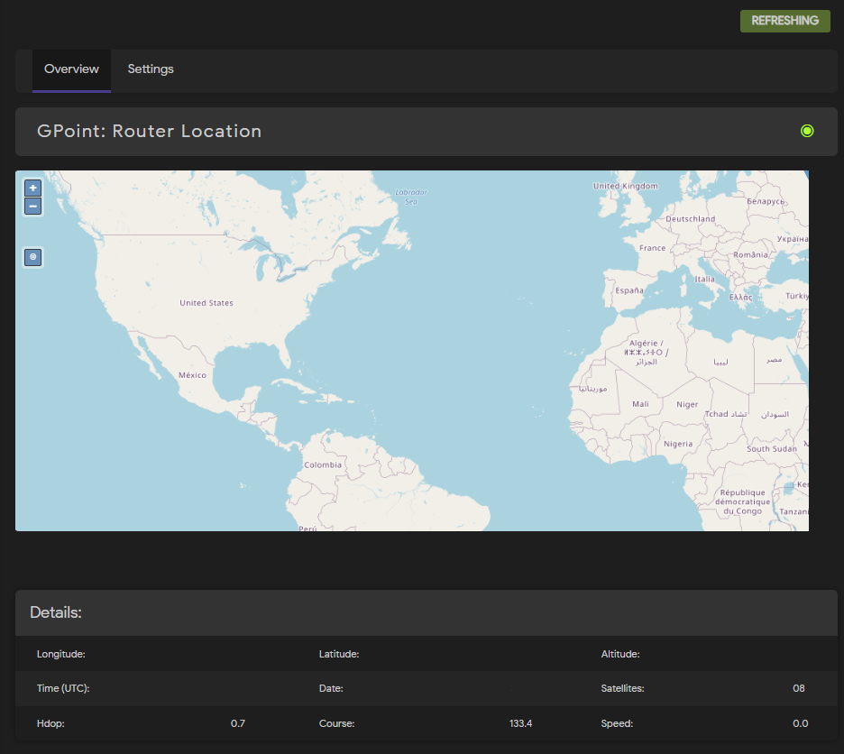
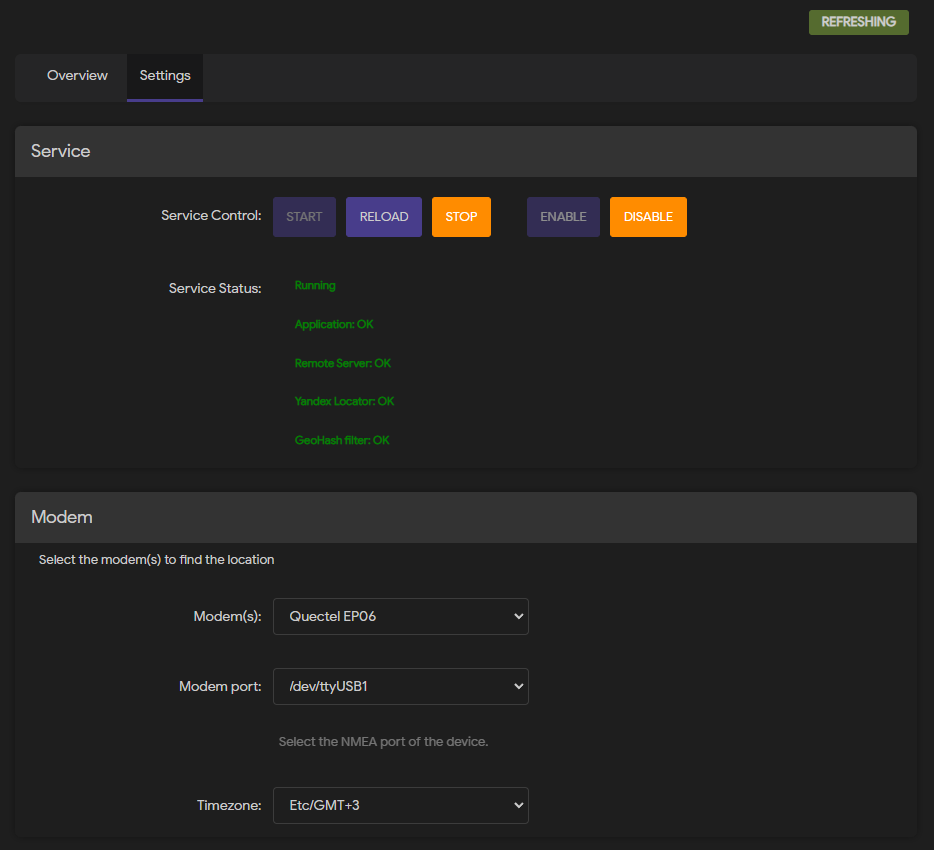

<h2 align="center">

<br>Global Navigation Satellite System for OpenWrt LuCi
<br>
</h2>

<p align="center">Gpoint was created in order to use full set of functions of mobile modules installed in OpenWRT router.
Manufacturers of GSM/3G/LTE modems often lay down GNSS function, so why not use it?
It doesn't matter if you use a router in transport or it is installed in your terminal, you can always find out its location!</p>

<details>
<summary>Screenshots</summary>




</details>

## Features

- Support: GPS, GLONASS (works with "NMEA 0183" standard protocol)
- [GPSD](https://gpsd.io) is supported for parsing NMEA data from a modem or your gps device
- GeoHash (reduces drift of GPS\GLONASS coordinate readings in parking)
- [Kalman filter](https://github.com/lacker/ikalman) (Implementation of Kalman filter for geo (gps) tracks.
  This is a Lua port of original C code)
- Yandex Locator [API](https://yandex.ru/dev/locator/) (Determines location by nearest Wi-Fi access points)
- Simple [GeoFence](https://en.wikipedia.org/wiki/Geo-fence) a virtual perimeter for a real-world geographic area
- Server side (sends GNSS data to a remote server)
- Support [OpenLayers](https://openlayers.org/) maps in UI, and much more!

## Supported devices

- Dell DW5821e/DW5829e
- Huawei ME909u-521
- MEIGLink SLM820/SLM828
- Quectel EC21/EC25/EP06/EM12/EM160R/RM500Q/RM520N
- Sierra EM7455/EM7565
- Simcom SIM7600E-H
- U-Blox VK-172 GPS/GLONASS module (u-blox 7 GNSS modules)

## Supported GNSS protocols

- [OsmAnd](https://www.traccar.org/osmand/)
- [Wialon IPS](https://gurtam.com/ru/gps-hardware/soft/wialon-ips)

## How to add an unsupported device

- Most importantly, your device should be able to constantly send NMEA data to any of the available ports.

  EXAMPLE: `/dev/ttyUSB*`

- In the model file, you must add the vid, pid, and name of your device.

  MODEL PATH: [/usr/lib/lua/luci/model/cbi/gpoint/gpoint.lua](luasrc/model/cbi/gpoint/gpoint.lua)

  ADD DEVICE:

  ```lua
  local modems = {
      ["Quectel"] = {
          ["2c7c:0306"] = "EP06",
          ...
      },
      ["MY_DEVICE_VENDOR_NAME"] = {
          ["PID:VID"] = "MODEL_NAME",
          ...
      }
  ```

- It is necessary to add commands to start/stop sending data to the port in the configuration file.
  (if such commands are not required, you must set "-" instead of commands)

  CONFIG PATH: [/usr/share/gpoint/lib/config.lua](root/usr/share/gpoint/lib/config.lua)

  ADD DEVICE:

  ```lua
  local MODEM = {
      DELL = {
          START = "AT+GPS=1",
          STOP = "AT+GPS=0"
      },
      MY_DEVICE_WITH_START/STOP_COMMAND = {
          START = "DEVICE_AT_COMMAND_TO_START",
          STOP = "DEVICE_AT_COMMAND_TO_STOP"
      },
      MY_DEVICE_WITHOUT_COMMAND = {
          START = '-',
          STOP = '-'
      }
  ```

- That's it! Now your device works with GPoint!

If there are any difficulties with adding a new device or you want to help the project,
open an issue or send a pull request with your changes!

Thank you for your interest in the project!

## Install

```console
# # Upload ipk file to tmp folder
# cd /tmp
# opkg update
# opkg install luci-app-gpoint_2.6.0_all.ipk
```

## Uninstall

```console
# opkg remove luci-app-gpoint
```

## LICENSE

Gpoint like OpenWrt is released under the GPL v3.0 License - see detailed [LICENSE](LICENSE).
